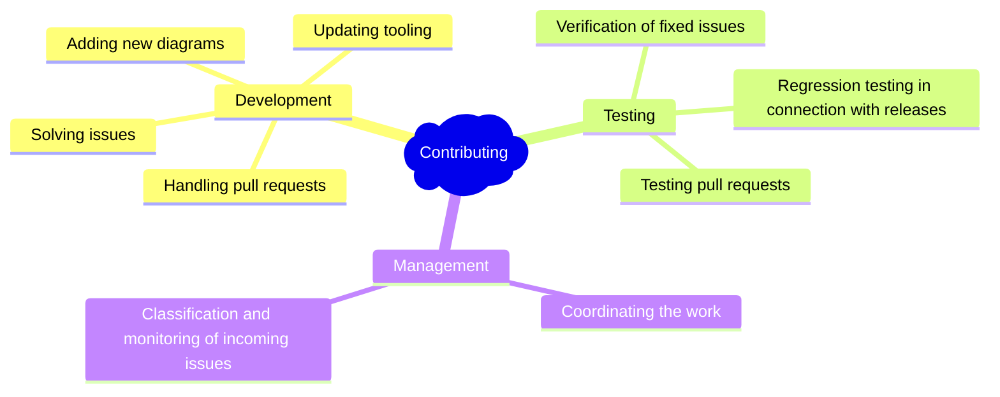

CREATE TABLE Hotel (
  HotelID SERIAL PRIMARY KEY,
  Name VARCHAR(255) NOT NULL,
  Address VARCHAR(255) NOT NULL,
  Phone VARCHAR(20),
  Email VARCHAR(255),
  Website VARCHAR(255),
  Amenities TEXT,
  Description TEXT
);

CREATE TABLE Guest (
  GuestID SERIAL PRIMARY KEY,
  Name VARCHAR(255) NOT NULL,
  Address VARCHAR(255) NOT NULL,
  Phone VARCHAR(20),
  Email VARCHAR(255),
  LoyaltyProgram VARCHAR(255),
  SpecialNeeds TEXT
);

-- Other tables and relationships follow similar structure

CREATE TABLE Reservation (
  ReservationID SERIAL PRIMARY KEY,
  GuestID INTEGER NOT NULL REFERENCES Guest(GuestID),
  RoomID INTEGER NOT NULL REFERENCES Room(RoomID),
  CheckInDate DATE NOT NULL,
  CheckOutDate DATE NOT NULL,
  NumberOfGuests INTEGER NOT NULL,
  Status ENUM('Confirmed', 'Pending', 'Cancelled'),
  SpecialRequests TEXT
);
# Getting Started

So you want to help? That's great!


Here are a few things to get you started on the right path.

## How can I help?



## Join the Development

```tip
**Check out our** [**detailed contribution guide**](./contributing.md).
```

Where to start:

- You could start getting some knowledge of the code base by working on [these "good first issues"](https://github.com/mermaid-js/mermaid/issues?utf8=%E2%9C%93&q=is%3Aissue+is%3Aopen+label%3A%22Good+first+issue%21%22+).
- You could jump right in and help us fix any of [these bugs](https://github.com/mermaid-js/mermaid/issues?q=is%3Aissue+is%3Aopen+label%3A%22Type%3A+Bug+%2F+Error%22++label%3A%22Contributor+needed%22+)!
- You could help write and [improve the documentation](https://github.com/mermaid-js/mermaid/issues?q=is%3Aissue+is%3Aopen+label%3A%22Area%3A+Documentation%22).
- You could work on a new feature! [These](https://github.com/mermaid-js/mermaid/issues?q=is%3Aissue+is%3Aopen+label%3A%22Area%3A+Development%22+label%3A%22Type%3A+Enhancement%22+label%3A%22Status%3A+Approved%22+) are some ideas!
- You could confirm the bugs in [these issues](https://github.com/mermaid-js/mermaid/issues?q=is%3Aissue+is%3Aopen+label%3A%22Status%3A+Triage%22++label%3A%22Type%3A+Bug+%2F+Error%22).

[Join our slack community if you want closer contact!](https://join.slack.com/t/mermaid-talk/shared_invite/enQtNzc4NDIyNzk4OTAyLWVhYjQxOTI2OTg4YmE1ZmJkY2Y4MTU3ODliYmIwOTY3NDJlYjA0YjIyZTdkMDMyZTUwOGI0NjEzYmEwODcwOTE)

## A Question Or a Suggestion?

```tip
**Have a look at** [**how to open an issue**](./questions-and-suggestions.md).
```

If you have faced a vulnerability [report it to us](./security.md).

## Last Words

Don't get daunted if it is hard in the beginning. We have a great community with only encouraging words. So, if you get stuck, ask for help and hints in the Slack forum. If you want to show off something good, show it off there.

[Join our Slack community if you want closer contact!](https://join.slack.com/t/mermaid-talk/shared_invite/enQtNzc4NDIyNzk4OTAyLWVhYjQxOTI2OTg4YmE1ZmJkY2Y4MTU3ODliYmIwOTY3NDJlYjA0YjIyZTdkMDMyZTUwOGI0NjEzYmEwODcwOTE)


